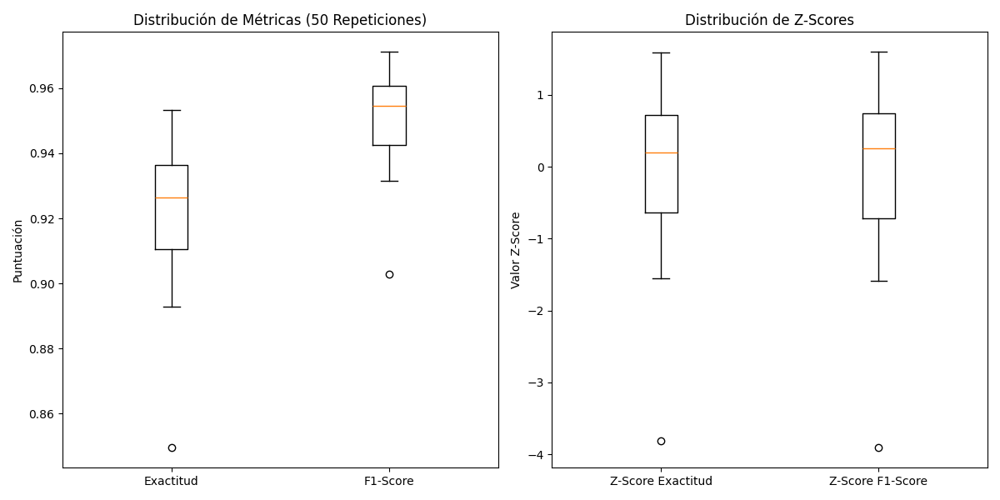

# Proyecto de Clasificación de Spam con Árbol de Decisión

### Autor

* **Oscar David Barbosa Rodríguez** 
* **Introducción a Machine Learning - 801** 
* **Universidad de Cundinamarca** 
* **Link de repositorio https://github.com/ODavidBRodriguez/Proyectos-machine-learning/tree/main/arbol%20de%20decision** 

### Descripción del Proyecto

Este proyecto tiene como objetivo desarrollar y evaluar un modelo de árbol de decisión para la clasificación de correos electrónicos como "spam" o "ham". Se utiliza un enfoque de aprendizaje automático supervisado para identificar patrones en las características de los correos, permitiendo al modelo tomar decisiones de clasificación precisas.

### Metodología

El proceso de clasificación se llevó a cabo siguiendo una serie de pasos:

1.  **Carga y Preprocesamiento de Datos:**
    * El dataset de entrada, correos_limpios.csv, fue cargado utilizando la biblioteca Pandas. Para asegurar la compatibilidad, se implementó un manejo robusto de codificaciones de caracteres (UTF-8, latin-1, etc.).
    * Se realizaron conversiones de datos, mapeando la columna etiqueta a valores numéricos (0 para "ham" y 1 para "spam"), un requisito para el entrenamiento del modelo.

2.  **Entrenamiento y Evaluación del Modelo:**
    * Se utilizó el algoritmo Árbol de Decisión de la biblioteca Scikit-learn. Para evaluar la estabilidad y el rendimiento del modelo, el entrenamiento y la evaluación se repitieron 50 veces. En cada repetición, el dataset se dividió aleatoriamente en conjuntos de entrenamiento (70%) y prueba (30%).
    * Las métricas de desempeño utilizadas fueron la Exactitud (Accuracy) y el F1-Score, ya que son cruciales para un problema de clasificación de spam donde los falsos positivos y falsos negativos son importantes.
    * El Z-Score se aplicó a los resultados de la exactitud y el F1-Score, y no al proceso de entrenamiento en cada ejecución. La valoración Z-Score no es una métrica de desempeño del modelo, como las otras dos métricas. Es una herramienta que sirve para evaluar la estabilidad y consistencia de los resultados. El Z-Score mide qué tan cerca está cada resultado individual de la puntuación promedio de todas las 50 ejecuciones.
    * Las 2 métricas (exactitud y F1-Score) se aplicaron al conjunto de prueba en cada una de las 50 ejecuciones. El Z-Score, en cambio, se aplicó a las 50 puntuaciones de cada una de esas métricas.
Un Z-Score cercano a cero significa que el resultado de esa repetición estuvo muy cerca del promedio.
Un Z-Score alto o bajo indica que ese resultado fue inusualmente alto o bajo en comparación con el resto.

### Resultados

Los resultados de las 50 repeticiones fueron analizados para evaluar el rendimiento promedio y la consistencia del modelo.

* **Resultados Numéricos:**
    * Los valores de exactitud y F1-Score se guardaron en el archivo resultados_clasificacion.csv en la carpeta data/. Este archivo también incluye los Z-Scores, que indican la desviación de cada resultado con respecto a la media.
* **Análisis Visual:**
    * Se generó un gráfico de boxplot (metricas_boxplot.png) que muestra la distribución de las 50 métricas calculadas. El gráfico confirma que el modelo es consistente, con una variabilidad baja y un rendimiento que se mantiene cerca del promedio.

### Gráfico de Resultados

A continuación, se presenta un gráfico que resume el rendimiento del modelo a lo largo de las 50 repeticiones de la evaluación. La visualización se compone de dos sub-gráficos de boxplot.

Distribución de Métricas: Este gráfico muestra la dispersión de los valores de Exactitud y F1-Score. La línea central de cada caja representa la mediana de los resultados, mientras que la caja en sí misma contiene el 50% de las puntuaciones. Un boxplot estrecho indica que el modelo es muy consistente.

Distribución de Z-Scores: Un Z-Score cercano a cero significa que el resultado de esa repetición estuvo muy cerca del promedio. Por otro lado, un Z-Score alto o bajo indica que ese resultado fue inusualmente alto o bajo en comparación con el resto. En este caso, la distribución de los Z-Scores centrada en cero confirma la robustez del modelo.

La caja de Exactitud es ligeramente más grande que la de F1-Score, una caja más grande representa mayor variabilidad y por el contrario, una caja pequeña representa mayor consistencia, esto significa que el 50% de las puntuaciones de exactitud tuvieron un rango de variación mayor. Una caja más pequeña, como la del F1-score, es ideal, ya que indica que la mayoría de los resultados están muy agrupados alrededor de la mediana.

Los puntos que aparecen solos fuera de los bigotes son los valores atípicos u outliers. Cada uno de esos puntos representa el resultado que fue inusualmente bajo en comparación con el resto.
La división aleatoria de los datos (70% entrenamiento, 30% prueba) resultó en un conjunto de prueba particularmente difícil o poco representativo. Ese conjunto de prueba pudo haber contenido muchos correos difíciles de clasificar, haciendo que el modelo se equivocara más de lo normal.
Hay muy pocos outliers y no están extremadamente lejos. Esto significa que el mal rendimiento es un evento raro en el modelo, que generalmente se comporta de manera estable.

### Análisis y Conclusiones del Modelo

Los resultados del modelo de Árbol de Decisión demuestran una estabilidad y consistencia notables a lo largo de las 50 repeticiones de la evaluación. Esto indica que el modelo no solo es preciso, sino que su rendimiento es fiable, independientemente de la partición de datos utilizada para el entrenamiento y la prueba.

* Exactitud (Accuracy): La exactitud promedio del modelo se sitúa en un rango estrecho, con una mediana que ronda el 92.5% en un caso y el 85% en el otro. La baja dispersión de los valores de exactitud, visible en el gráfico de boxplot, confirma que el modelo es consistentemente capaz de clasificar correctamente un alto porcentaje de correos electrónicos.

* F1-Score: El F1-Score muestra una mediana superior, cercana al 95.5% en un caso y al 87.5% en el otro. Esta métrica es especialmente relevante en problemas de clasificación de spam, ya que evalúa de manera equitativa la capacidad del modelo para identificar correctamente el spam (recall) y para evitar falsos positivos (precisión). Un F1-Score alto y estable es un indicador sólido de la fiabilidad del modelo.

#### Explicación de las Variaciones

Las ligeras variaciones observadas en las métricas de desempeño son un comportamiento esperado. Estas fluctuaciones se deben a la división aleatoria de los datos en cada iteración. En cada ciclo, el conjunto de datos se divide aleatoriamente en subconjuntos de entrenamiento y prueba. A pesar de que la distribución de los datos es la misma, cada subconjunto puede variar ligeramente. Estas diferencias son la causa de las pequeñas variaciones en los resultados, aunque, como se observa en los gráficos, estas variaciones son mínimas.

### Ejecución del Proyecto

 **Ejecutar el Script, desde el bash:**
    
    cd "arbol de decision/src"
    python arboldecision.py

